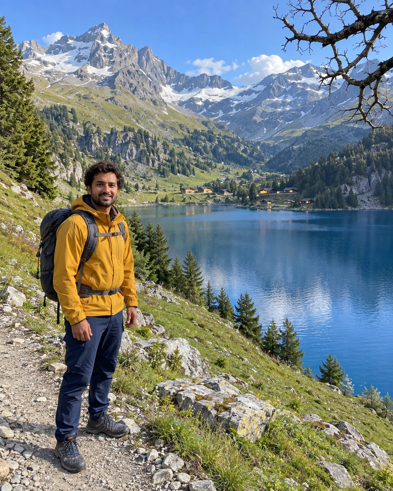
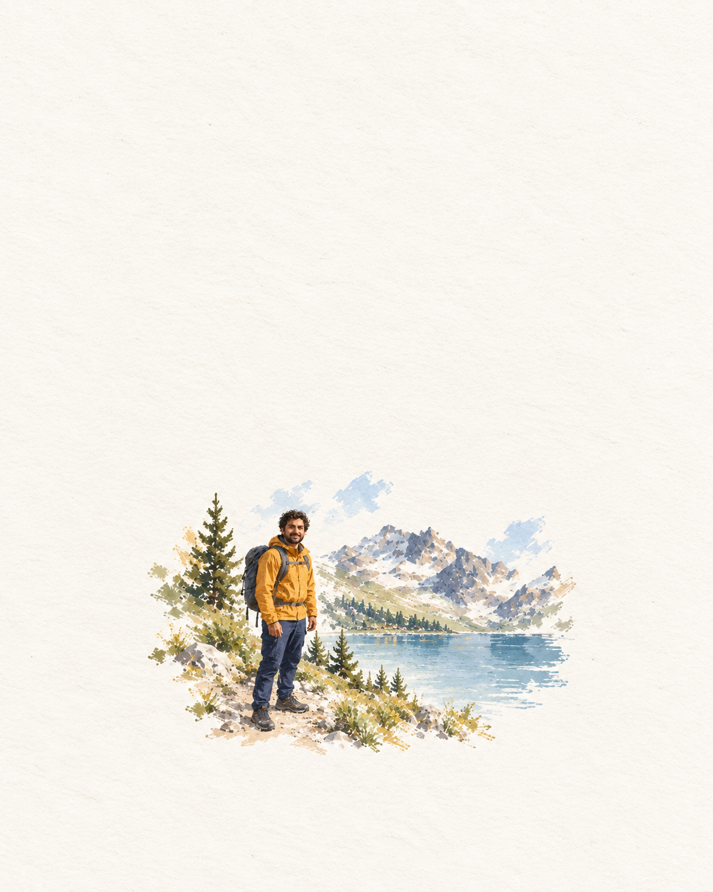
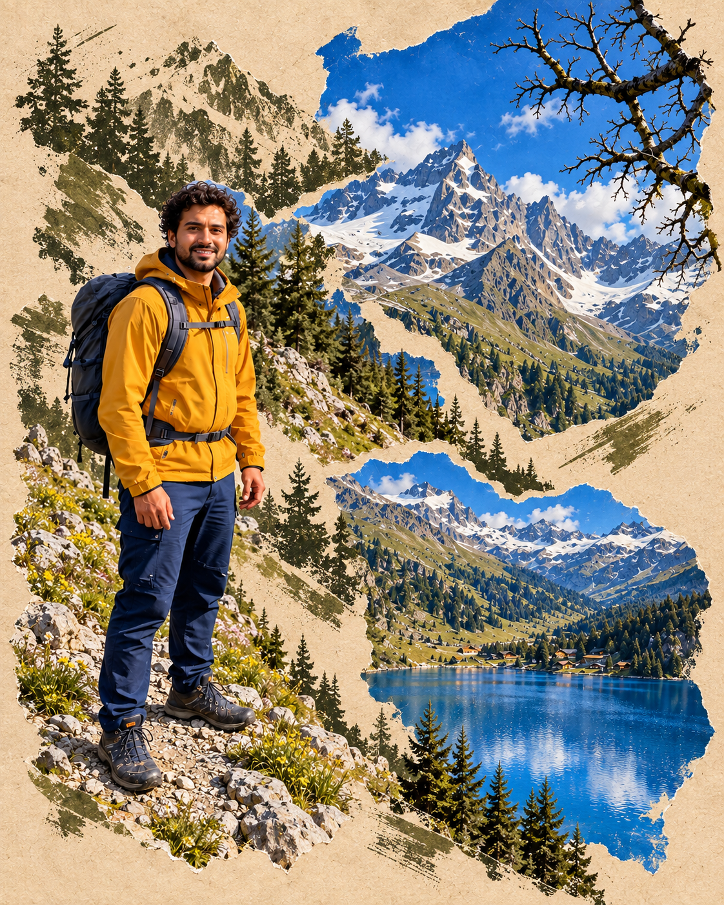
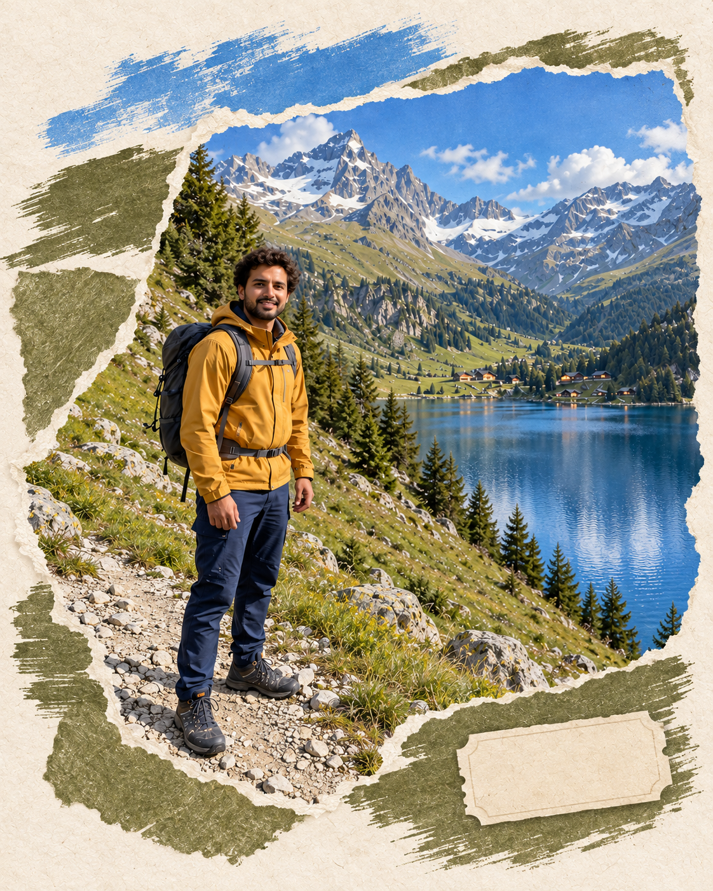
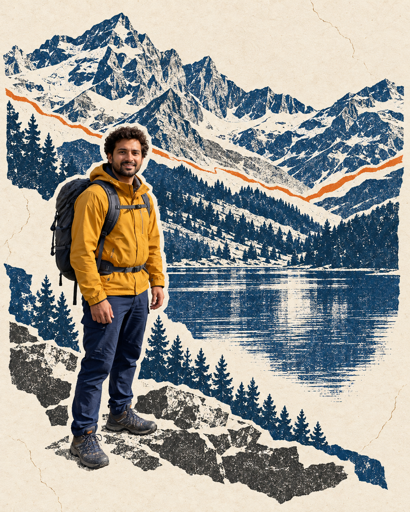

# Photo Collage Skill

把授权照片做成撕纸拼贴和旅行印刷明信片，可在 Codex 中用一句话调用。

**致敬 Kapi 照片创作体验的独立 remake，非官方、无关联，不包含其代码/模型/模板。** 开源的是 Skill 与工作流程；图像由当前 Codex 环境实际提供的图像编辑能力生成。

## 实际示例

下面的输入是本项目新生成的虚构旅行照片，五张输出由同一输入分别编辑而来。它们演示配方的区别，不代表对任意真实人像都能保持完全一致。没有转载抖音作者照片。

| 合成演示输入 | 留白干刷明信片 | 蓝米撕纸 |
|---|---|---|
|  |  |  |

| 橄榄绿自然拼贴 | 雪山单色印刷 | 深蓝夜景颗粒 |
|---|---|---|
|  |  |  |

## 三步使用

1. 下载本仓库。将 `skills/photo-collage` 整个目录复制到 `$CODEX_HOME/skills/`；未设置 `CODEX_HOME` 时放到 `~/.codex/skills/`。如果已存在同名技能，先检查版本，避免直接覆盖。
2. 重启 Codex 或开启能重新加载技能的新会话。提供你有权编辑的照片，可选附上风格参考。
3. 直接调用：`用 $photo-collage 把这张照片做成 blue-beige-torn，4:5，保留我的衣服和脸，不加文字。`

其他可选名：`drybrush-postcard`、`olive-nature-torn`、`alpine-mono-print`、`cobalt-night-grain`。也可自然表达“用这张原片做米蓝色撕纸拼贴”；保留默认自动发现，无需修改系统权限。

## 能力与边界

- 首版处理静态照片。复古调色、裁剪蒙版和纸张叠层本身是传统处理；重绘、补画或生成纹理才涉及生成能力。不能由外观推断某个相机功能的内部实现。
- 默认走 Codex 内置图像生成/编辑工具，不需要用户配置 API key。本仓库不提供图像模型、CLI 或假的 MCP 命令。运行环境若没有能接受原片的编辑工具，Skill 会说明阻塞并交付提示词，不谎称已生成。
- 内置图像服务可能联网、闭源或消耗现有额度；本项目不承诺纯离线，也不代表图像服务免费。Skill 不安装 Kapi、不逆向接口、不搬运付费模板、不设置密钥、不自行转传其他第三方。
- 参考只用于布局、色彩和质感。默认保留原片人物、衣服、姿势和关键物件；不复制参考中的人，也不推断其身份。默认没有文字，社交平台界面会被剔除。

## 来源与验证

五种配方来自公开展示的视觉观察，名称是本项目描述名。[配方与来源可靠性](skills/photo-collage/references/styles.md)逐项说明原帖观察和教程二次展示。页面点赞数仅为当时观察值，不是官方热榜。

真实作者展示的一组原图/成片已在私下做同图编辑对照，整体印刷感觉相近，仍有画面密度与局部细节差距。第三方输入和衍生图不发布。本仓库的五款示例是合成输入试跑，不能替代五款公开原帖的同图复现验收。

结构校验和场景干跑会验证缺图、缺工具、UI 排除与输入角色规则。当前会话不能热加载新装技能；已验证文件安装，不把自然语言自动发现写成已实测成功。新会话仍需实际调用确认。生成式编辑也可能改变脸部与衣服细节，重要纪念照片建议逐张检查。

示例包含生成式重绘及少量新增装饰；提示词的尺寸和元素约束不能视为工具必定严格遵守。完整检查结论见 [验证记录](docs/validation.md)。

## 许可

本项目原创 Skill 文本和文档使用 [MIT](LICENSE)。示例是本项目通过 Codex 图像工具新生成的演示素材，生成来源记录于 [examples/provenance.md](examples/provenance.md)；它们不属于 Kapi 或抖音作者素材。MIT 不为所调用的图像服务、模型或第三方照片授予许可，使用时仍遵循该服务条款与素材权限。
