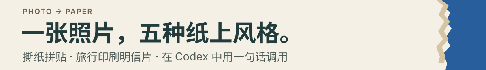
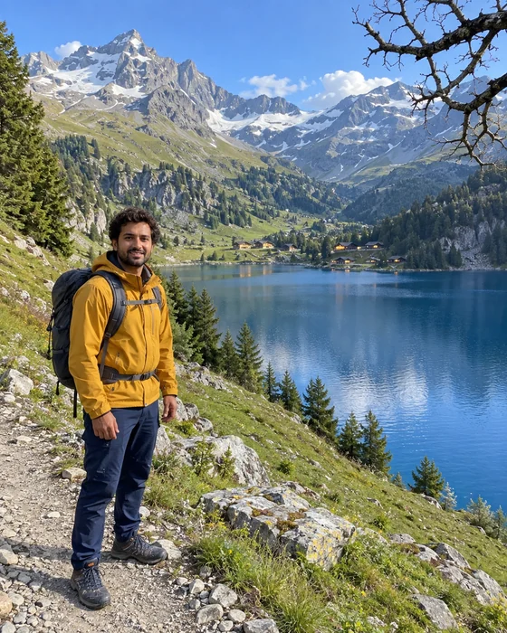
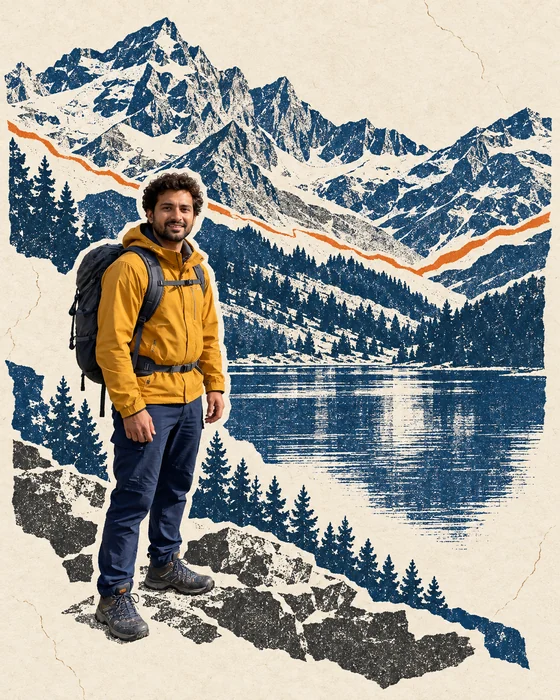
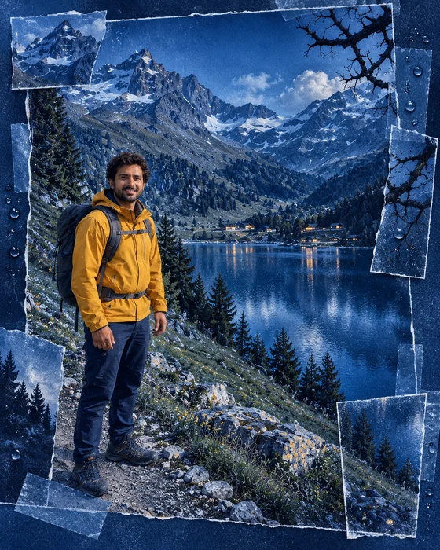
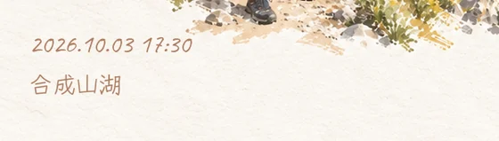

# Photo Collage Skill

<p align="center">
  
</p>

把你有权编辑的照片做成**撕纸拼贴或旅行印刷明信片**，在 Codex 中用一句话调用。五种配方、两种明信片交付形态，可选地点与日期手写标注。

[看效果](#从一张照片出发) · [开始使用](#三步开始) · [明信片参数](#明信片两种交付形态) · [使用边界](#能力与边界)

## 从一张照片出发

同一张合成演示原片，换一种纸张、布局和印刷质感。点击图片查看 PNG 母版。

| 合成演示原片 | 蓝米撕纸 · `blue-beige-torn` |
| --- | --- |
| [](examples/input.png) | [](examples/blue-beige-torn.png) |

输入是本项目生成的**虚构人物与旅行场景**，五款输出由它实际编辑而来，不是用户实拍，也没有转载抖音作者照片。页面使用 560 像素宽 WebP 预览，高清 PNG 单独保留；生成卡片仍可能重绘脸部、衣服和场景细节。

致敬 **Kapi 照片创作体验**的独立 remake，非官方、无关联，不包含其代码、模型或模板。本仓库提供 Skill 与工作流程；图像编辑由当前环境实际提供的工具完成。

| 橄榄绿自然拼贴 · `olive-nature-torn` | 雪山单色印刷 · `alpine-mono-print` |
| --- | --- |
| [](examples/olive-nature-torn.png) | [](examples/alpine-mono-print.png) |

| 深蓝夜景颗粒 · `cobalt-night-grain` | 留白干刷明信片 · `drybrush-postcard` |
| --- | --- |
| [](examples/cobalt-night-grain.png) | [](examples/postcard-only-handwritten.png) |

想要大片留白，选 `drybrush-postcard`；想保留照片层次，选两款撕纸配方；想加强印刷表现，选单色或深蓝颗粒。[完整风格配方](skills/photo-collage/references/styles.md)。

## 三步开始

1. **安装 Skill。** 下载本仓库，将整个 `skills/photo-collage` 目录复制到 `~/.agents/skills/photo-collage`。保留脚本、参考文档和字体；若已有同名技能，先核对版本和本地修改，避免覆盖。[Codex 技能目录说明](https://learn.chatgpt.com/docs/build-skills#where-codex-loads-local-skills)。
2. **提供照片。** 在能发现该技能的新会话中上传你有权编辑的原片，可选附上风格参考。若技能未出现，重启 Codex 后再检查。
3. **说出你要的风格。** 例如：

```text
用 $photo-collage 把这张照片做成 blue-beige-torn，竖版 4:5，
保留我的衣服和脸，不加文字。
```

也可以直接说“用这张原片做米蓝色撕纸拼贴”。需要能接受原片的图像编辑工具；环境缺少该能力时，技能会说明阻塞并交付方案与提示词。

## 明信片两种交付形态

`postcard_only`（默认）交付单独卡片；`stacked_original` 把原片与卡片合为一张图。两种形态均用于 `drybrush-postcard`。

| 单独明信片 | 上原片，下明信片 |
| --- | --- |
| <a href="examples/postcard-only-handwritten.png"></a> | <a href="examples/postcard-stacked-handwritten.png"></a> |

上面的标注为明确传入的演示参数：`location=合成山湖`、`date=2026.10.03`、`time=17:30`，不代表实际拍摄地点或时间。

**手写标注的实际局部**，裁自上面的成片：

[](examples/handwritten-caption-detail.png)

| 参数 | 可选值或行为 |
| --- | --- |
| `output_mode` | `postcard_only` 或 `stacked_original`；默认前者 |
| `location` | 用户原样提供的地点；省略则不添加 |
| `date`、`time` | 用户原样提供的日期和时间；省略项不添加 |
| 卡片比例 | 未指定时按竖版 4:5 提示；上下整图比例随原片和卡片尺寸变化 |

```text
用 $photo-collage 做 drybrush-postcard，
output_mode=postcard_only，不加文字。
```

```text
用 $photo-collage 做 drybrush-postcard，
output_mode=stacked_original，
location=杭州，date=2026.10.03，time=17:30。
```

日期与时间在下卡片左下第一行，地点在下一行。中文使用附带的**悠哉**，英文和数字使用 **Caveat**，保持暖棕色 `#AE7E63`；不使用系统字体回退，缺字或文字放不下时会报错。不会猜测地点、时间或自动公开 EXIF 信息。

排字、上下拼接和预览压缩使用确定性后处理，需要已有 **Python + Pillow**；不安装系统字体，无需额外图像 API key。上下模式保留原片显示朝向和尺寸，只按原片宽度缩放下卡片。原片一致性检查针对无损母版中的 **8 位 RGBA 显示像素**，不代表保留 ICC 配置或高位深归档。[后处理步骤与命令](skills/photo-collage/references/postcard-output.md)。

## 能力与边界

- **静态照片。** 支持纸张拼贴和印刷风格，不提供实时相机、视频或图像模型。传统调色、裁剪与叠层和生成式重绘应分开理解，不能根据外观推断 Kapi 的内部实现。
- **工具依赖。** 使用当前 Codex 环境的图像编辑能力，不需要用户配置 API key。图像服务可能联网、闭源或消耗现有额度；本项目不承诺纯离线或服务免费。
- **人物与参考。** 默认保留原片人物、衣服、姿势和重要物件，参考只用于布局、色彩与质感。生成式编辑可能改变细节，重要纪念照片应逐张检查；不复制参考人物，不保留社交平台 UI，默认不加文字。
- **素材与原片。** 不安装 Kapi、不逆向接口、不搬运付费模板、不自行转传照片给额外第三方。后处理不覆盖原片；展示用压缩预览，高清母版单独保留。

## 来源与验证

五种名称是本项目提炼的**描述名**，不是 Kapi 官方模板。公开原帖仅作为视觉观察来源；本仓库示例使用合成输入，不发布第三方照片或其衍生图，也不把它们当作五款原帖的同图复现验收。

<details>
<summary>查看来源、示例生成记录与既有验证证据</summary>

- [公开来源逐项观察与差距](docs/source-evidence.md)：区分原帖观察、合成输入试跑与同原片复现；四款海报原帖提到 Codex/Skill，不能统称为 Kapi 原生效果。
- [示例来源与生成记录](examples/provenance.md)：同一合成输入的实际编辑、修正及后处理记录，不猜测工具未提供的模型版本。
- [压缩、双模式与原片一致性实测](docs/output-validation.md)：既有示例的尺寸、哈希与压缩体积；文件体积变化不等于所有网络环境的加载速度。
- [手写标注验证](docs/handwriting-validation.md)及[实际旧字/新字对比](examples/handwriting-before-after.png)：记录字体修正、文字区域和原文核对。
- [验证记录](docs/validation.md)：结构检查、场景干跑与实际生成的区别，以及尚未验证的范围。

这些记录说明本次合成演示的结果，不保证跨照片一致性、五官像素保真或自然语言自动发现已在每个环境实测成功。

</details>

## 许可

原创 Skill 与项目文档使用 [MIT](LICENSE)。公开示例由本项目通过 Codex 图像工具新生成，来源见 [示例记录](examples/provenance.md)；它们不是 Kapi 或抖音作者素材。MIT 不为所调用的图像服务、模型或第三方照片授予许可，使用时仍需遵循服务条款与素材权限。

附带的未修改字体为悠哉 Regular 0.868 与 Caveat 2.000，分别保留完整 [悠哉 OFL](skills/photo-collage/assets/fonts/Yozai-OFL.txt)、[Caveat OFL](skills/photo-collage/assets/fonts/Caveat-OFL.txt)和原版权，不按项目 MIT 重新授权。[字体来源、版本与哈希](skills/photo-collage/assets/fonts/provenance.json)。字体只随技能下载，README 不加载字体文件。
