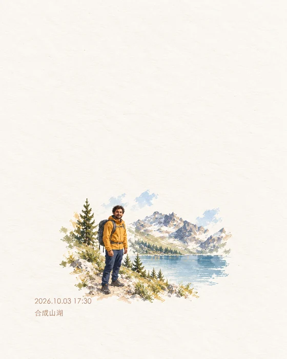
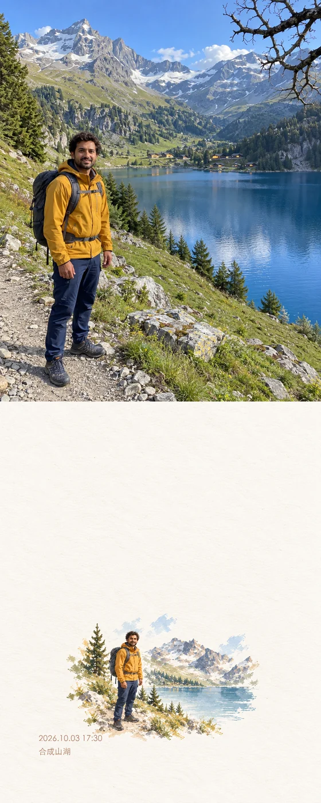

# Photo Collage Skill

把授权照片做成撕纸拼贴和旅行印刷明信片，可在 Codex 中用一句话调用。

**致敬 Kapi 照片创作体验的独立 remake，非官方、无关联，不包含其代码/模型/模板。** 开源的是 Skill 与工作流程；图像由当前 Codex 环境实际提供的图像编辑能力生成。

## 实际示例

下面使用本项目生成的[虚构旅行原图（高清）](examples/input.png)。五款风格由同一输入实际编辑而来；没有转载抖音作者照片。页面加载 560 像素宽的 WebP 预览，点击图片可查看无损 PNG 母版。

明信片支持两种最终形态。示例文字是明确传入的演示参数：`location=合成山湖`、`date=2026.10.03`、`time=17:30`，不代表实际拍摄地点时间。日期/时间与下一行地点以中文手写字体霞鹜文楷排在卡片左下，保留暖棕色 `#AE7E63`。

| 单独明信片 `postcard_only` | 上原图、下明信片 `stacked_original` |
|---|---|
| [](examples/postcard-only-captioned.png) | [](examples/postcard-stacked-captioned.png) |

上下整图通过确定性合成完成，上方原片的无损像素与输入一致；最终整体比例随原片和卡片尺寸变化，不把原片拉伸到固定比例。下方生成图仍可能重绘细节。[无字卡片高清](examples/drybrush-postcard.png)。

| 蓝米撕纸 | 橄榄绿自然拼贴 |
|---|---|
| [](examples/blue-beige-torn.png) | [](examples/olive-nature-torn.png) |

| 雪山单色印刷 | 深蓝夜景颗粒 |
|---|---|
| [](examples/alpine-mono-print.png) | [](examples/cobalt-night-grain.png) |

## 三步使用

1. 下载本仓库。将 `skills/photo-collage` 整个目录复制到 `$CODEX_HOME/skills/`；未设置 `CODEX_HOME` 时放到 `~/.codex/skills/`。如果已存在同名技能，先检查版本，避免直接覆盖。
2. 重启 Codex 或开启能重新加载技能的新会话。提供你有权编辑的照片，可选附上风格参考。
3. 直接调用：`用 $photo-collage 把这张照片做成 blue-beige-torn，4:5，保留我的衣服和脸，不加文字。`

其他可选名：`drybrush-postcard`、`olive-nature-torn`、`alpine-mono-print`、`cobalt-night-grain`。也可自然表达“用这张原片做米蓝色撕纸拼贴”；保留默认自动发现，无需修改系统权限。

明信片调用示例：

```text
用 $photo-collage 做 drybrush-postcard，output_mode=postcard_only，不加文字。
用 $photo-collage 做 drybrush-postcard，output_mode=stacked_original，location=杭州，date=2026.10.03，time=17:30。
```

`output_mode` 默认 `postcard_only`；`location`、`date`、`time` 均可省略，省略项不添加。不要猜测地点时间或自动公开 EXIF 信息。文字、拼接和预览由确定性工具后处理；附带的辅助脚本需要已有 Python + Pillow；中文手写字体已随 Skill 附带，中文、英文和数字使用同一字体，缺字时报错。无需给图像工具增加 API key。[后处理步骤与命令](skills/photo-collage/references/postcard-output.md)。

## 能力与边界

- 首版处理静态照片。复古调色、裁剪蒙版和纸张叠层本身是传统处理；重绘、补画或生成纹理才涉及生成能力。不能由外观推断某个相机功能的内部实现。
- 默认走 Codex 内置图像生成/编辑工具，不需要用户配置 API key。本仓库不提供图像模型、CLI 或假的 MCP 命令。运行环境若没有能接受原片的编辑工具，Skill 会说明阻塞并交付提示词，不谎称已生成。
- 内置图像服务可能联网、闭源或消耗现有额度；本项目不承诺纯离线，也不代表图像服务免费。Skill 不安装 Kapi、不逆向接口、不搬运付费模板、不设置密钥、不自行转传其他第三方。
- 参考只用于布局、色彩和质感。默认保留原片人物、衣服、姿势和关键物件；不复制参考中的人，也不推断其身份。默认没有文字，社交平台界面会被剔除。

## 来源与验证

五种均有实际查看的对应原帖视觉来源，名称是本项目描述名。以下点赞数为 2026-10-03 查看时页面值，不是官方热榜；四种海报原帖明确提到 Codex/Skill，不能统称为 Kapi 原生模板。

| 配方 | 实际查看的来源 | 可见点赞 | 输入与输出证据 |
|---|---|---:|---|
| 干刷明信片 | [@liu](https://www.douyin.com/search/kapi%E6%8B%BC%E8%B4%B4?modal_id=7685729175148376290&type=general) | 约 5.8 万 | 原图/明信片同屏 |
| 蓝米撕纸 | [@听见了吗📸](https://www.douyin.com/search/%E8%BF%99%E4%B8%AAskill%E7%9A%84%E5%AE%A1%E7%BE%8E%E6%81%90%E6%80%95%E5%9C%A8%E6%88%91%E4%B9%8B%E4%B8%8A?modal_id=7670548738029557925&type=general) | 约 3.4 万 | 树木成片；未见该主图原片 |
| 橄榄绿自然 | [@北原千夏](https://www.douyin.com/search/%E7%AC%AC63%E9%9B%86%20%E8%BF%99%E4%B8%AAskill%E7%9A%84%E7%BE%8E%E5%95%86%E6%81%90%E6%80%95%E5%9C%A8%E6%88%91%E4%B9%8B%E4%B8%8A?modal_id=7670916508982356849&type=general) | 约 6.2 万 | 草原、风车与票根成片/原图同屏 |
| 雪山单色 | [@凌晨奔巴士 v2](https://www.douyin.com/search/%E8%BF%99%E4%B8%AAskill%E7%9A%84%E5%AE%A1%E7%BE%8E%E6%81%90%E6%80%95%E5%9C%A8%E6%88%91%E4%B9%8B%E4%B8%8A?modal_id=7671536283285512817&type=general) | 约 3.5 万 | 雪山原图/印刷成片同屏 |
| 深蓝颗粒 | [@凌晨奔巴士](https://www.douyin.com/search/%E8%BF%99%E4%B8%AAskill%E7%9A%84%E5%AE%A1%E7%BE%8E%E6%81%90%E6%80%95%E5%9C%A8%E6%88%91%E4%B9%8B%E4%B8%8A?modal_id=7670855844619249529&type=general) | 约 66.6 万 | 深蓝撑伞原图/成片同屏 |

[逐项视觉判断与差距](docs/source-evidence.md)、[配方与来源可靠性](skills/photo-collage/references/styles.md)区分原帖观察、合成输入试跑和同原片复现。蓝米多照片组合、深蓝胶带与小相框是本项目的设计扩展，不称为原帖逐图复刻。这里只链接原帖，不转载其照片。

真实作者展示的一组原图/成片已在私下做同图编辑对照，整体印刷感觉相近，仍有画面密度与局部细节差距。第三方输入和衍生图不发布。本仓库的五款示例是合成输入试跑，不能替代五款公开原帖的同图复现验收。

结构校验和场景干跑会验证缺图、缺工具、UI 排除与输入角色规则。当前会话不能热加载新装技能；已验证文件安装，不把自然语言自动发现写成已实测成功。新会话仍需实际调用确认。生成式编辑也可能改变脸部与衣服细节，重要纪念照片建议逐张检查。

示例包含生成式重绘及少量新增装饰；提示词的尺寸和元素约束不能视为工具必定严格遵守。完整检查结论见 [验证记录](docs/validation.md)。

展示图片由原先六张高清 PNG 的 **18.88 MB** 降为六张 WebP 预览的 **0.80 MB**，减少 **95.74%**。高清文件保留；这只是展示资源体积变化，不能承诺所有网络环境的页面耗时。[压缩、双模式与原片一致性实测](docs/output-validation.md)。

字体修正见 [实际效果与独立验证](docs/handwriting-validation.md)：只改文字区域，主体画面、暖棕色和原文保持。

## 许可

本项目原创 Skill 文本和文档使用 [MIT](LICENSE)。示例是本项目通过 Codex 图像工具新生成的演示素材，生成来源记录于 [examples/provenance.md](examples/provenance.md)；它们不属于 Kapi 或抖音作者素材。MIT 不为所调用的图像服务、模型或第三方照片授予许可，使用时仍遵循该服务条款与素材权限。

附带的未修改霞鹜文楷 Regular 1.522 使用 [SIL Open Font License 1.1](skills/photo-collage/assets/fonts/OFL.txt)，保留原版权；该字体不适用本项目 MIT。来源和文件哈希见 [字体记录](skills/photo-collage/assets/fonts/provenance.json)。字体约 25.58 MB，仅随技能下载，README 仍加载图片预览。
